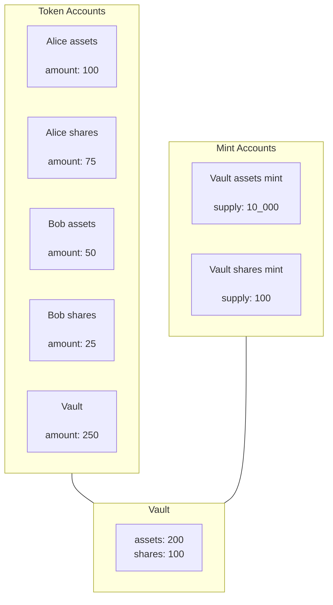

# Certora Vault Example Tutorial

This tutorial builds a simple Tokenized Vault, inspired by the  [ERC-4626
TOKENIZED VAULT STANDARD](https://eips.ethereum.org/EIPS/eip-4626) on Ethereum.




The basic operations of the vault are 
  * `deposit` -- deposit assets and obtain shares
  * `redeem` -- burn shares and obtain assets
  * `reward` -- process reward that is accumulated in the vault asset account
  * `slash` -- deduct some assets from the vault

The basic functionality is extended to include:
  * __fees__ -- fees are deducted in assets during deposit
  * __fee collection__ -- fee is optionally stored in the vault and can be claimed by a designated operator
  * __exact deposit__ -- only takes as much assets as needed to cover shares obtained by the user. This protects from an inflation attack.

Throughout the tutorial, you are invited to add the missing functionality, and formally verify correctness of your implementation. Partial implementation of the features described above is provided as a reference.

## Content

- [Installation](#installation)
- [Code structure](#code-structure)
- [Specifications](#specifications)

## Installation
1. First, visit [Certora.com](https://www.certora.com) and sign up for a free account [here](https://www.certora.com/signup).
2. You will receive an email with a temporary password and a personal access key. Use the password to login to Certora following the link in the email.
3. During the workshop, we recommend following along by using Github Codespaces that you can launch from this repository.
4. Once your codespace has launched, you should have a web-based editor that looks like VSCode.
5. From the terminal of this editor, use the personal access key (from Step 2) to set a temporary environment variable like so `export CERTORAKEY=<personal_access_key>`.

## Code structure

The main logic of the vault is organized as follows. 

- The `Vault` is defined in `programs/vault/src/state.rs`

- Core vault operations are located in `programs/vault/src/operations`
 
  These operations implement the vault's asset and shares logic
  (independent of Solana runtime):

1. `vault_deposit_assets(vault, tokens_amount)`
2. `vault_redeem_shares(vault, shares_amout)`
3. `vault_update_reward(vault, new_amount)`
4. `vault_process_slash(vault, slash_amount)`

Additional functions that support fees:

- `vault_deposit_assets_with_fee(vault, tokens_amount)`
- `vault_collect_fee`


Vault functions that operates on Solana `AccountInfo` are
implemented in `programs/vault/src/processor`:

1. `process_deposit(accounts, tokens_amount)`
2. `process_redeem_shares(accounts, shares_amount)`
3. `process_update_reward(accounts, new_amount)`
4. `process_slash(accounts, slash_amount)`

Fee-based processor functions are also provided.

## Specifications

All formal specifications are located in
`programs/vault/src/certora/specs`.

Notation:

- Vault assets: $\text{assets}$

- Vault shares: $\text{shares}$

- Tokens held in the SPL account: $\text{token}_{\text{amount}}$

- Total minted supply of SPL tokens: $\text{mint}_{\text{supply}}$

- fee in basis points (max = `10_000`): $\text{fee}_{\text{bps}}$
 
- fee deducted from a given operation: $\text{fee}$


### Simple properties 

- Assets should not decrease:

```math
\text{assets}_{\text{post}}  \geq \text{assets}_{\text{pre}}
```


- Shares should not decrease:

```math
\text{shares}_{\text{post}}  \geq \text{shares}_{\text{pre}}
```

- Monotonicity of assets and shares 

```math
\text{assets}_{\text{pre}} \leq \text{assets}_{\text{post}} \implies \text{shares}_{\text{pre}}  \leq \text{shares}_{\text{post}}
```

### Vault consistency

The vault must remain consistent with the underlying SPL accounts:

```math
\text{assets} \leq \text{token}_{\text{amount}} \wedge \text{shares} = \text{mint}_{\text{supply}}
```

### No dilution 

To maintain proportional ownership (except during slashing
operations), the vault must ensure:


```math
 \frac{\text{assets}_{\text{pre}}}{\text{shares}_{\text{pre}}} \leq \frac{\text{assets}_{\text{post}}}{\text{shares}_{\text{post}}}
```

This guarantees that the asset-to-share ratio does not decrease after
any operation.

### Solvency

The vault needs to ensure the following invariant to remain solvent:


```math
\text{shares} \leq \text{assets}
```


### Fees

- If a fee rate is configured, then a corresponding fee must be
deducted for any successful execution:

```math
\text{fee}_{\text{bps}} > 0 \implies \text{fee} > 0 
```

- Fee computation never reverts (liveness property)

- If fee rate is not configurated then `deposit_assets` and `deposit_assets_with_fees` are equivalent 

```math
\text{fee}_{\text{bps}} = 0 \implies \forall~ vault, amount.~\text{deposit\_assets}(vault, amount) = \text{deposit\_assets\_with\_fees}(vault, amount)
```

### Inflation attack

An [inflation attack](https://blog.openzeppelin.com/a-novel-defense-against-erc4626-inflation-attacks) is an attack on a tokenized vault in which an attacker inflates the share price, causing a victim to lose assets to the vault due to rounding. The attacker is then extract the profit by redeeming its shares in the vault.

We show how to use Certora Prover to explore both the attack and different mitigation. Specifically, we show that when virtual shares and assets are used, the attacker cannot profit, but can still cause harm.

We then propose a mitigation that limits rounding to 1 atom, but only extracting the exact amount of the assets from the user that is needed to cover the shares. We show that with this "exact" deposit, the loss (and therefore the win to the attacker) is limited to 1 atom.


## DISCLAIMER
The code and examples provided in this repository are for educational purposes only. They are not production-ready and may contain bugs or security vulnerabilities. Use at your own risk.
